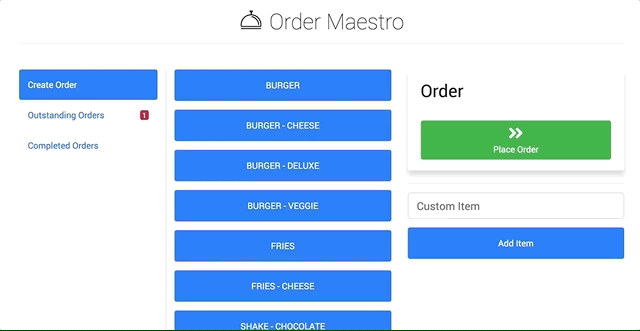

# Order Maestro

Order Maestro is the easiest to use restaurant order management app available!

[Live Demo](https://order-maestro-123.herokuapp.com/)

## Tech
- HTML
- CSS
- Javascript/jQuery
- Bootstrap
- Node.js
- Node Packages
  - [Express](https://www.npmjs.com/package/express) - Node web framework
  - [Express-handlebars](https://www.npmjs.com/package/express-handlebars) - Template engine
  - [Sequelize](https://www.npmjs.com/package/sequelize) - ORM
  - [Mysql2](https://www.npmjs.com/package/mysql2) - For sequelize
- Deployed on Heroku
  - JawsDB - For MySQL

## Learning Points
- Deploying to Heroku with a database
- Using Handlebars with Express
- Utilizing an ORM
- Creating an MVC app

## Author
Craig Melville
